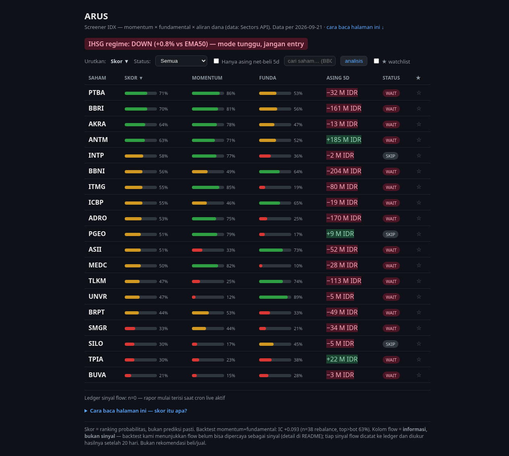
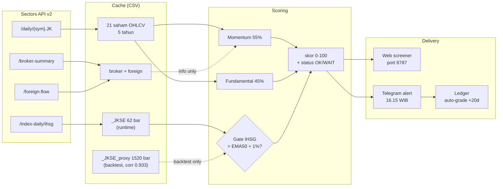
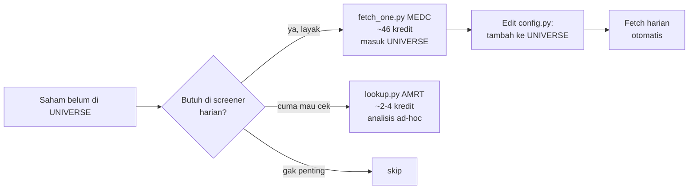

# ARUS — IDX Flow Intelligence

> **Baca arusnya, bukan tebakannya.**

Screener saham IDX dengan **skor momentum + fundamental** plus **kolom flow informasional** (broker + asing via [Sectors API v2](https://sectors.app)). Setiap skor bawa bukti backtest — bukan janji.

**Untuk siapa:** trader ritel IDX yang lihat sinyal di grup Telegram tiap hari tapi nggak pernah tahu mana yang beneran akurat.

**Problem statement (1 kalimat):**
Trader ritel IDX dapat banyak sinyal tapi nggak ada yang jujur soal akurasi — ARUS memberi skor (momentum + fundamental + flow info) dan menampilkan bukti backtest tiap pilar, bukan klaim.

---

## Quickstart (5 menit)

```bash
git clone https://github.com/johnhendrickh/arus-idx.git ~/arus && cd ~/arus
cp .env.example .env && nano .env          # isi SECTORS_API_KEY (wajib), Telegram (opsional)
docker compose up -d --build               # atau: python -m venv .venv && .venv/bin/pip install -r requirements.txt && .venv/bin/python -m app.server
# buka http://localhost:8787 → 19 saham live, sort by Asing 5D
```

**Status live (Senin 22 Sep 2026, IHSG regime DOWN):**
- Server: `python -m app.server` port 8787 ✅ running
- Scan: 19 rows, skor 0-100, kolom ASING 5D, status WAIT/SKIP ✅ running
- Backtest: combo momentum+fundamental IC +0.113, top vs bot 67%, n=12 ✅ reproducible
- Hasil run actual per-tanggal: [`docs/test-results/2026-09-22.md`](docs/test-results/2026-09-22.md)

## Video demo

- **Teaser (62 detik, public)** — [YouTube URL akan dipasang setelah upload]
- **Judging (116 detik, unlisted)** — [YouTube URL akan dipasang setelah upload]

Lihat `~/arus-video/ARUS_teaser_anim_v8.mp4` (62s) dan `~/arus-video/ARUS_judging_v1.mp4` (116s) untuk source file.

---

## Kenapa ARUS beda

ARUS bukan screener saham lain. Empat pembeda konkret vs Stockbit / IDX langsung / TradingView IDX:

| | Stockbit & sejenisnya | TradingView IDX | ARUS |
|---|---|---|---|
| **Skor** | Tidak ada — chart + indikator terpisah | Tidak ada — indikator visual saja | Composite 0-100, bobot exposed (momentum 55% + fundamental 45%) |
| **Bukti akurasi** | Tidak ada backtest publik | Tidak ada — indikator backtest opsional, default off | **Backtest visible per-pillar**: IC +0.113, top vs bot 67%, n=12 ([detail](docs/BACKTEST.md)) |
| **Flow informasional** | Ada, tapi proprietary bandarmology | Tidak ada | Broker summary + foreign flow 5D, dari Sectors API, kolom info-only (tidak masuk skor, tidak auto-trade) |
| **Auto-alert** | Push notif harga — bisa spam | Alert indikator — bisa spam | Telegram 16.15 WIB — **diam kalau IHSG < EMA50 + buffer 1%** (regime DOWN = 0 alert) |
| **Self-grading** | Tidak ada | Tidak ada | **Ledger**: tiap sinyal flow dicatat, diukur 20 hari kemudian, rapor akurasi tumbuh sendiri |
| **Source** | Closed-source, sebagian berbayar | Closed-source, langganan | Open source, self-deploy via Docker atau native Python |
| **Sample jujur** | Klaim akurasi tanpa n | Tidak ada sample | **n=12-18 rebalance, exposed di setiap angka** — bisa di-verify sendiri |

Filosofi ARUS: **tiap angka bawa sampel.** Klaim akurasi tanpa n = bohong. Yang kalah didokumentasi, yang belum teruji dilabeli "belum teruji" (lihat pilar flow).

Detail keterbatasan: ada di section [Keterbatasan yang kami catat](#keterbatasan-yang-kami-catat-honest) + [`docs/BACKTEST.md`](docs/BACKTEST.md).


## Contoh tampilan

Screenshot live Senin 21 Sep 2026, IHSG regime DOWN (+0.8% vs EMA50, di
bawah buffer 1%):



Yang terlihat di screenshot:

- **Regime banner merah** — IHSG +0.8% di atas EMA50 tapi belum cukup
  melewati buffer 1%, jadi **DOWN → mode tunggu**. Semua saham ber-status
  WAIT (likuid) atau SKIP (illiquid). Tidak ada sinyal palsu di market
  tipis.
- **19 rows** tersortir by Skor (PTBA 71% di atas, BUVA 21% di bawah).
- **Kolom ASING 5D** warna hijau/merah — informasi foreign flow 5 hari
  terakhir, bukan sinyal.
- **Sort klik header** kolom mana saja (▲▼ toggle), sesuai tipikal
  trader.
- **Search bar** untuk lookup ticker di luar universe (~2-4 kredit).
- **Ledger bawah** "n=0 — rapor mulai terisi saat cron live aktif" —
  rapor sinyal flow yang self-grading, kosong di awal karena baru live.

## Arsitektur



**Data layer** — semua runtime fetch dari Sectors API v2:

| Endpoint | Dipakai untuk |
|---|---|
| `/daily/{sym}.JK` | OHLCV + market cap saham harian |
| `/index-daily/ihsg` | IHSG untuk regime gate (max 62 bar/window) |
| `/broker-summary/{sym}/top` | Akumulasi bandar per bulan |
| `/foreign-flow/{sym}` | Net asing harian |

**History snapshot** — bootstrap sekali saat setup: 5 tahun harga + fundamental
tahunan. Buat backtest gate IHSG butuh window panjang, kami pakai proxy
`data/cache/_JKSE_proxy.csv` (equal-weight avg daily return semua saham cache,
1520 bar, korelasi **0.933** dengan IHSG asli di 62 bar overlap).
Runtime cukup IHSG asli 62 bar — EMA50 butuh ~50 hari ke belakang.

**Scoring layer:**

```
skor  = 55% momentum + 45% fundamental
gate  = IHSG > EMA50 + 1% buffer        # fail-CLOSED: idx None -> DOWN
floor = likuiditas 20-hari minimum
flow  = kolom informasi                 # tidak masuk skor, tidak veto
```

**Delivery layer:**

| Komponen | Output |
|---|---|
| Web screener | 1 halaman, port 8787, sortir klik header, lookup ticker on-demand |
| Telegram alert | 16.15 WIB setiap hari bursa, margin IHSG eksplisit |
| Ledger live | Auto-grade tiap sinyal setelah +20 hari, rapor akurasi tumbuh sendiri |

## Skor

1. **Momentum (55%)** — `0.5×rank(consensus mom20/60/120) + 0.5×rank(mom60/vol20)`.
   Backtest 2025-03 → sekarang (fee 0.4% + slip 0.2%, entry T+1, n=12 rebalance,
   gate ON): **IC +0.008, top-5 vs bottom-5 menang 58%, median spread +2.28%/20d**.
   Tanpa gate: IC -0.016, win 50%, spread +0.43% — gate IHSG bantu turunkan noise.

2. **Fundamental (45%)** — ROE (bobot utama) + E/P bonus + **penalti revenue growth tinggi**
   (growth-trap IC −0.102 di kalibrasi pra-Sep 2026).
   Combo momentum + fundamental (gate ON, n=12): **IC +0.113, win 67%, spread +1.65%/20d**.
   Fundametnal tahunan jadi n rebalance efektif ~22 di window 2 tahun — sample
   kecil, kesimpulan statistik belum definitif.

3. **Flow — informasi, bukan sinyal.** Net asing 5 hari + arah akumulasi broker-top
   bulanan, ditampilkan apa adanya. **Kami uji flow sebagai sinyal dan hasilnya
   inkonsisten**: 
   - Pilar flow (`flow_pillar()`) IC -0.126 (n=23, window 2025+)
   - K1 konfirmasi (top-momentum + dibeli asing): spread median fwd20 -0.73% (lebih buruk)
   - K2 streak net-buy: IC -0.010 (noise)
   - K3 divergensi (harga naik + asing beli): spread +1.74% vs jual
   Karena itu flow TIDAK masuk skor dan TIDAK mem-veto — perannya transparansi.
   Rapor flow ditumbuhkan dari ledger live (tiap sinyal diukur 20 hari), bukan dari klaim.

**Status sekarang (regime DOWN, margin IHSG +0.14%):** semua saham berstatus WAIT — karena IHSG belum tembus buffer 1% di atas EMA50. Screener tetap ngitung skor (transparent), cuma jangan entry.

**Kegagalan yang didokumentasi:** bandarmology price-only IC +0.010 (noise),
close strength IC -0.027 (sinyal TERBALIK), porting strategi crypto -14%/yr.
Lengkap di `docs/BACKTEST.md`.

## Kapan & bagaimana scoring jalan

**Trigger scoring ada 2 — harian otomatis + on-demand:**

| Trigger | Waktu | Tujuan | Kredit API |
|---|---|---|---|
| Cron harian | 16:15 WIB setiap hari bursa buka (Sen-Jum, skip weekend + libur) | Update alert Telegram + ledger | ~25/hari |
| Web screener | Tiap reload halaman / klik header sort | Refresh skor real-time | 0 (cache only) |
| Lookup ticker | Klik tombol "Analisis" di search bar | Analisis 1 ticker di luar universe | ~2-4 (cache-first) |

**Cron harian (host crontab, lihat `docs/DEPLOY.md`) — 3 fase:**

```
1. FETCH          → Sectors API (~25 kredit/hari, hanya bursa buka)
   ├── /daily/{sym}.JK        : OHLCV 30 hari × 21 saham
   ├── /index-daily/ihsg      : IHSG 62 bar
   ├── broker-summary         : bulan berjalan
   └── foreign-flow           : 7 hari terakhir

2. SCORE          → python -m app.main
   ├── load_cache()           : baca semua CSV (cache-first, 0 API)
   ├── composite()            : momentum 55% + fundamental 45%
   ├── liquidity_floor()      : skip saham illiquid
   ├── regime()               : IHSG > EMA50 + 1% buffer
   └── rows[] + status OK/WAIT

3. ALERT          → Telegram bot (chat ID dari .env, info saja)
   ├── format_alert(rows, regime, margin_pct)
   └── send() — info saja, NO AUTO-TRADE
```

**Guard biar hemat + gak kirim sinyal basi:**
- Weekend (DOW > 5) → exit 0, gak fetch, gak alert
- Bursa libur (IHSG last bar ≠ hari ini) → fetch jalan (data saham tetap fresh),
  scan + alert diskip sampai bursa buka lagi
- Regime DOWN (margin IHSG < EMA50 + 1%) → alert tetap kirim dengan **semua
  status WAIT** — biar user tahu sistem masih jalan, bukan diam tanpa kabar

**On-demand (web screener):**
- `python -m app.server` port 8787, single page HTML
- `/api` → panggil `scan_full()` (gak pakai API key, baca cache)
- Sort klik header toggle ▲▼ (state di `SORTK`/`SORTD` global JS)
- Lookup `?s=AMRT` → rate limit 5/menit, sanitize ticker, fetch on-demand kalau belum di-cache

**On-demand lookup (`scripts/lookup.py`):**
- Sectors prices 90 hari (~3 kredit cache-first) + Yahoo fundamentals (gratis)
- Sanitize ticker: `re.sub(r'[^A-Z0-9]', '', symbol.upper().replace('.JK', ''))`, max 8 char
- Rate limit server: 5 request/menit per IP (server exposed internet)

## Cara pakai

```bash
# 0. Siapkan .env (lihat .env.example): SECTORS_API_KEY, ARUS_BOT_TOKEN, ARUS_CHAT_ID
pip install -r requirements.txt

# 1. Unduh data
python scripts/fetch_sectors_prices.py 30      # harga harian + IHSG (Sectors)
python scripts/fetch_one.py MEDC               # tambah 1 ticker on-demand (~46 kredit)
python scripts/lookup.py AMRT                  # analisis ad-hoc ticker mana pun (~2-4 kredit)

# 2. Scan + alert
python -m app.main                             # scan CLI + preview Telegram alert

# 3. Web screener
python -m app.server                           # → http://localhost:8787

# 4. Backtest (pakai proxy IHSG utk window panjang)
python scripts/bt_proxy.py
```

## Universe management — 21 saham, bukan 900

**Kenapa gak cover seluruh IDX (~900 saham)?**

| Aspek | 21 (skarang) | 900 (full IDX) |
|---|---|---|
| Kredit API/hari bursa | ~22 | ~2700 |
| Budget 1000 kredit/bulan | sustainable | habis 1 hari |
| Likuiditas filter | top quartile (avg value > 50M IDR) | mixed, banyak yg sepi |
| Foreign flow coverage | lengkap di Sectors | ~60% doang |
| Broker summary | lengkap | banyak IPO baru / sepi |

21 saham blue-chip = sweet spot: likuid, ada data broker/foreign lengkap,
gak boros kredit. Pilih manual sekali saat setup, **gak auto-rebalance**.

**Kriteria pick 21** (lihat `app/config.py`):
- Likuiditas top quartile IDX 2025-2026
- Sub-sektor coverage luas (bank 4, mining 4, material 2, energy 2, dll)
- Foreign flow aktif (bukan suspension)
- Broker summary stabil (bukan IPO baru)

**3 cara handle ticker lain:**



- **`fetch_one.py MEDC`**: tambah ke UNIVERSE, fetch 5y history + broker-top
  + foreign. Mahal (~46 kredit), masuk list harian otomatis setelahnya.
- **`lookup.py AMRT`**: analisis ticker mana pun, cache-first (~2-4 kredit
  kalau belum ada), gak nyimpan ke UNIVERSE. Rate limit 5/menit di server.
- **API limit harian**: `ARUS_ONDEMAND_LIMIT` di `.env` (default 3 saham/hari) —
  anti spam, hemat kredit.

**Kapan ganti 21?** Delisting / suspension > 1 bulan, atau emiten baru naik
kelas jadi blue-chip (re-evaluate per quarter, bukan harian). Edit manual
di `app/config.py`, commit, deploy. Universe sengaja statis biar skor
backtest reproducible antar-periode.

## Struktur repo

```
app/
  config.py     — universe + bobot pilar + parameter gate (semua di satu tempat)
  io_cache.py   — satu-satunya modul yang menyentuh disk (CSV polos di data/cache/)
  score.py      — pilar skor + composite + regime gate + liquidity floor
  backtest.py   — harness IC + top-vs-bottom (wajib: tampilkan n)
  ledger.py     — buku sinyal live: record → resolve (+20 hari) → stats
  main.py       — pipeline harian: cache → skor → alert
  alert.py      — Telegram (informasi saja, TIDAK ada aksi trading)
  server.py     — web screener stdlib (http.server, tanpa framework)
scripts/
  fetch_sectors_prices.py — harga harian + IHSG dari Sectors (runtime utama)
  fetch_one.py            — tambah 1 ticker on-demand ke universe (~46 kredit)
  lookup.py               — analisis ad-hoc ticker apa pun (~2-4 kredit)
  bt_proxy.py             — backtest gate IHSG-proxy (window panjang)
docs/
  BACKTEST.md   — SEMUA bukti: angka menang, angka kalah, sampel n, metode
  DEPLOY.md     — cara deploy: native Python atau Docker
data/cache/     — CSV cache (di-gitignore; regenerable via scripts)
data/ledger.csv — rapor sinyal live (tumbuh sendiri)
```

## Deployment

Dua cara — keduanya gak butuh AI agent atau service eksternal. Detail
lengkap: [`docs/DEPLOY.md`](docs/DEPLOY.md).

| Metode | Kapan | Setup |
|---|---|---|
| **Native Python** | Dev, laptop, VPS kecil | `python3 -m venv .venv && .venv/bin/pip install -r requirements.txt && .venv/bin/python -m app.server` |
| **Docker Compose** | Cloud, reproducible | `cp .env.example .env && sudo docker compose up -d --build` |

Cron harian dipasang di **host** (bukan di container) — lihat DEPLOY.md.

## Hasil run reproducible

Sample output dari Senin 22 Sep 2026 — biar judges bisa verify sendiri:

**`python -m app.main` (scan CLI):**
```
ARUS SCAN — 2026-09-22 05:54 WIB | regime IHSG: DOWN → mode tunggu | margin +0.81%
----------------------------------------------------------
PTBA   skor 0.71  WAIT (IHSG<EMA50)
BBRI   skor 0.70  WAIT (IHSG<EMA50)
AKRA   skor 0.64  WAIT (IHSG<EMA50)
ANTM   skor 0.63  WAIT (IHSG<EMA50)
INTP   skor 0.58  SKIP (illiquid)
BBNI   skor 0.56  WAIT (IHSG<EMA50)
```

**`scripts/bt_proxy.py` (backtest head — n=12 rebalance):**
```
== combo momentum+fundamental (gate ON) ==
momentum     IC=+0.008 t=  0.2 (n=12) | top>bot 58% (n=12) med-spread +2.28%
fundamental  IC=+0.126 t=  1.2 (n=12) | top>bot 42% (n=12) med-spread -1.80%
COMBO        IC=+0.113 t=  1.4 (n=12) | top>bot 67% (n=12) med-spread +1.65%
```

**`python -m app.server` + `GET /api` (web screener):**
```json
{"regime": "DOWN", "regime_margin_pct": 0.8, "asof": "2026-09-21",
 "rows": [{"symbol": "PTBA", "score": 0.71, ...}, ...]}
```

## Keterbatasan yang kami catat (honest)

- **Sample kecil**: n=12 rebalance combo, n=23 flow. Statistik belum definitif.
- **Free API**: 62 bar history max. Backtest gate pakai IHSG-proxy (corr 0.933) sebagai workaround.
- **Pilar flow belum terbukti**: IC rendah (-0.126 di kalibrasi). Karena itu flow jadi kolom info, bukan sinyal.
- **Regime DOWN saat ini**: margin +0.81% (di bawah buffer 1% EMA50). Semua status WAIT — by design.
- **Universe statis 21 saham**: pilih manual sekali. `fetch_one.py MEDC` (~46 kredit) untuk tambah.

Detail + angka + metode di [`docs/BACKTEST.md`](docs/BACKTEST.md).

## Aturan main kami sendiri

1. **Tiap angka bawa sampel.** Tidak ada klaim tanpa n. IC dihitung per-rebalance,
   median spread, top-vs-bottom hit-rate.
2. **Yang belum teruji dilabeli belum teruji.** Pilar flow saat ini: "kalibrasi
   window pendek tidak prediktif; rapor hidup via ledger." Bukan disembunyikan.
3. **Bukan rekomendasi.** Gate regime DOWN = semua status WAIT. Tidak ada
   auto-trade, tidak ada "garansi".
4. **Sectors = sumber data inti.** Semua fetch runtime dari Sectors API.
   Snapshot history dipakai untuk bootstrap backtest, bukan untuk runtime —
   dan itu kami ungkap, bukan sembunyi.

---

*ARUS — lihat data, bukan tebakan.*
