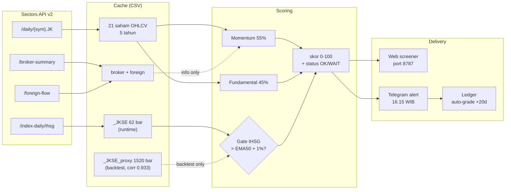

# ARUS — IDX Flow Intelligence

> **Baca arusnya, bukan tebakannya.**

Screener saham IDX dengan **skor momentum + fundamental** plus **kolom flow informasional** (broker + asing via [Sectors API v2](https://sectors.app)). Setiap skor bawa bukti backtest — bukan janji.

**Untuk siapa:** trader ritel IDX yang lihat sinyal di grup Telegram tiap hari tapi nggak pernah tahu mana yang beneran akurat.

**Problem statement (1 kalimat):**
Trader ritel IDX dapat banyak sinyal tapi nggak ada yang jujur soal akurasi — ARUS memberi skor (momentum + fundamental + flow info) dan menampilkan bukti backtest tiap pilar, bukan klaim.

---

## Kenapa ARUS beda

| Alat sinyal biasa | ARUS |
|---|---|
| "Sinyal beli X!" tanpa bukti | IC, hit-rate, dan jumlah sampel (n) ditampilkan bersama skor |
| Klaim akurasi 90% | Backtest dengan fee + slippage, n eksplisit, kegagalan didokumentasi |
| Bandarmology dari pola harga (tebakan) | Data broker & foreign flow **asli** dari Sectors API |
| Sinyal spam tiap hari | Gate regime IHSG (EMA50 + buffer 1%) — diam saat market tipis |

## Arsitektur



**Data layer** — semua runtime fetch dari Sectors API v2:

| Endpoint | Dipakai untuk |
|---|---|
| `/daily/{sym}.JK` | OHLCV + market cap saham harian |
| `/index-daily/ihsg` | IHSG untuk regime gate (max 62 bar/window) |
| `/broker-summary/{sym}/top` | Akumulasi bandar per bulan |
| `/foreign-flow/{sym}` | Net asing harian |

**History snapshot** — bootstrap sekali saat setup: 5 tahun harga + fundamental
tahunan. Buat backtest gate IHSG butuh window panjang, kami pakai proxy
`data/cache/_JKSE_proxy.csv` (equal-weight avg daily return semua saham cache,
1520 bar, korelasi **0.933** dengan IHSG asli di 62 bar overlap).
Runtime cukup IHSG asli 62 bar — EMA50 butuh ~50 hari ke belakang.

**Scoring layer:**

```
skor  = 55% momentum + 45% fundamental
gate  = IHSG > EMA50 + 1% buffer        # fail-CLOSED: idx None -> DOWN
floor = likuiditas 20-hari minimum
flow  = kolom informasi                 # tidak masuk skor, tidak veto
```

**Delivery layer:**

| Komponen | Output |
|---|---|
| Web screener | 1 halaman, port 8787, sortir klik header, lookup ticker on-demand |
| Telegram alert | 16.15 WIB setiap hari bursa, margin IHSG eksplisit |
| Ledger live | Auto-grade tiap sinyal setelah +20 hari, rapor akurasi tumbuh sendiri |

## Skor

1. **Momentum (55%)** — `0.5×rank(consensus mom20/60/120) + 0.5×rank(mom60/vol20)`.
   Backtest 2025-03 → sekarang (fee 0.4% + slip 0.2%, entry T+1, n=12 rebalance,
   gate ON): **IC +0.008, top-5 vs bottom-5 menang 58%, median spread +2.28%/20d**.
   Tanpa gate: IC -0.016, win 50%, spread +0.43% — gate IHSG bantu turunkan noise.

2. **Fundamental (45%)** — ROE (bobot utama) + E/P bonus + **penalti revenue growth tinggi**
   (growth-trap IC −0.102 di kalibrasi pra-Sep 2026).
   Combo momentum + fundamental (gate ON, n=12): **IC +0.113, win 67%, spread +1.65%/20d**.
   Fundametnal tahunan jadi n rebalance efektif ~22 di window 2 tahun — sample
   kecil, kesimpulan statistik belum definitif.

3. **Flow — informasi, bukan sinyal.** Net asing 5 hari + arah akumulasi broker-top
   bulanan, ditampilkan apa adanya. **Kami uji flow sebagai sinyal dan hasilnya
   inkonsisten**: 
   - Pilar flow (`flow_pillar()`) IC -0.126 (n=23, window 2025+)
   - K1 konfirmasi (top-momentum + dibeli asing): spread median fwd20 -0.73% (lebih buruk)
   - K2 streak net-buy: IC -0.010 (noise)
   - K3 divergensi (harga naik + asing beli): spread +1.74% vs jual
   Karena itu flow TIDAK masuk skor dan TIDAK mem-veto — perannya transparansi.
   Rapor flow ditumbuhkan dari ledger live (tiap sinyal diukur 20 hari), bukan dari klaim.

**Status sekarang (regime DOWN, margin IHSG +0.14%):** semua saham berstatus WAIT — karena IHSG belum tembus buffer 1% di atas EMA50. Screener tetap ngitung skor (transparent), cuma jangan entry.

**Kegagalan yang didokumentasi:** bandarmology price-only IC +0.010 (noise),
close strength IC -0.027 (sinyal TERBALIK), porting strategi crypto -14%/yr.
Lengkap di `docs/BACKTEST.md`.

## Cara pakai

```bash
# 0. Siapkan .env (lihat .env.example): SECTORS_API_KEY, ARUS_BOT_TOKEN, ARUS_CHAT_ID
pip install -r requirements.txt

# 1. Unduh data
python scripts/fetch_sectors_prices.py 30      # harga harian + IHSG (Sectors)
python scripts/fetch_one.py MEDC               # tambah 1 ticker on-demand (~46 kredit)
python scripts/lookup.py AMRT                  # analisis ad-hoc ticker mana pun (~2-4 kredit)

# 2. Scan + alert
python -m app.main                             # scan CLI + preview Telegram alert

# 3. Web screener
python -m app.server                           # → http://localhost:8787

# 4. Backtest (pakai proxy IHSG utk window panjang)
python scripts/bt_proxy.py
```

## Struktur repo

```
app/
  config.py     — universe + bobot pilar + parameter gate (semua di satu tempat)
  io_cache.py   — satu-satunya modul yang menyentuh disk (CSV polos di data/cache/)
  score.py      — pilar skor + composite + regime gate + liquidity floor
  backtest.py   — harness IC + top-vs-bottom (wajib: tampilkan n)
  ledger.py     — buku sinyal live: record → resolve (+20 hari) → stats
  main.py       — pipeline harian: cache → skor → alert
  alert.py      — Telegram (informasi saja, TIDAK ada aksi trading)
  server.py     — web screener stdlib (http.server, tanpa framework)
scripts/
  fetch_sectors_prices.py — harga harian + IHSG dari Sectors (runtime utama)
  fetch_one.py            — tambah 1 ticker on-demand ke universe (~46 kredit)
  lookup.py               — analisis ad-hoc ticker apa pun (~2-4 kredit)
  bt_proxy.py             — backtest gate IHSG-proxy (window panjang)
docs/
  BACKTEST.md   — SEMUA bukti: angka menang, angka kalah, sampel n, metode
data/cache/     — CSV cache (di-gitignore; regenerable via scripts)
data/ledger.csv — rapor sinyal live (tumbuh sendiri)
```

## Aturan main kami sendiri

1. **Tiap angka bawa sampel.** Tidak ada klaim tanpa n. IC dihitung per-rebalance,
   median spread, top-vs-bottom hit-rate.
2. **Yang belum teruji dilabeli belum teruji.** Pilar flow saat ini: "kalibrasi
   window pendek tidak prediktif; rapor hidup via ledger." Bukan disembunyikan.
3. **Bukan rekomendasi.** Gate regime DOWN = semua status WAIT. Tidak ada
   auto-trade, tidak ada "garansi".
4. **Sectors = sumber data inti.** Semua fetch runtime dari Sectors API.
   Snapshot history dipakai untuk bootstrap backtest, bukan untuk runtime —
   dan itu kami ungkap, bukan sembunyi.

---

*ARUS — peserta Hackathon Sectors 2026, Track 03 (Market Intelligence).
Repo ini dibekukan setelah deadline sesuai ketentuan panitia.*
