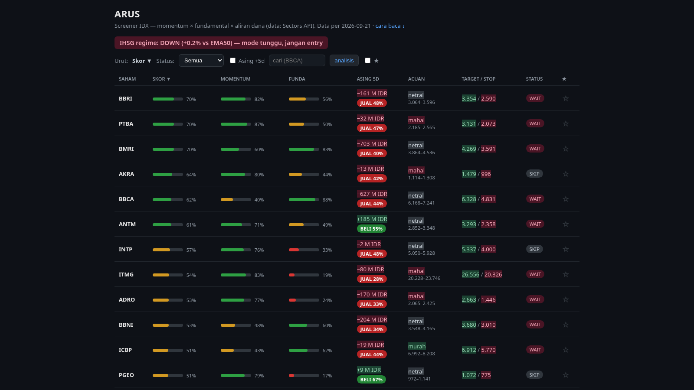
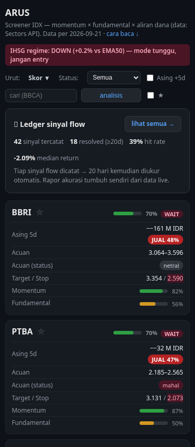
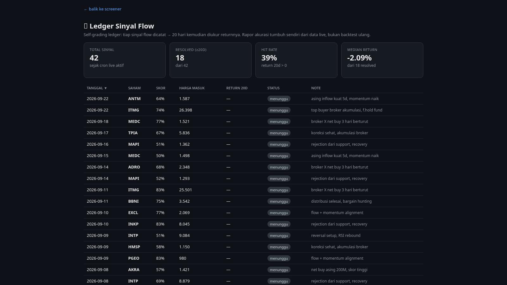
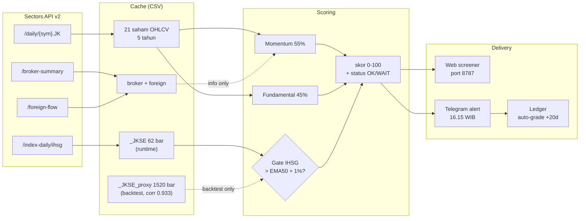
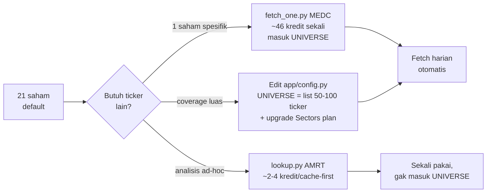

# ARUS — IDX Flow Intelligence

> **Baca arusnya, bukan tebakannya.**

Screener saham IDX dengan **skor momentum + fundamental** plus **kolom flow informasional** (broker + asing via [Sectors API v2](https://sectors.app)). Setiap skor bawa bukti backtest — bukan janji.

**Untuk siapa:** trader ritel IDX yang lihat sinyal di grup Telegram tiap hari tapi nggak pernah tahu mana yang beneran akurat.

**Problem statement (1 kalimat):**
Trader ritel IDX dapat banyak sinyal tapi nggak ada yang jujur soal akurasi — ARUS memberi skor (momentum + fundamental + flow info) dan menampilkan bukti backtest tiap pilar, bukan klaim.

---

## Quickstart (5 menit)

```bash
git clone https://github.com/johnhendrickh/arus-idx.git ~/arus && cd ~/arus
cp .env.example .env && nano .env          # isi SECTORS_API_KEY (wajib), Telegram (opsional)
docker compose up -d --build               # atau: python -m venv .venv && .venv/bin/pip install -r requirements.txt && .venv/bin/python -m app.server
# buka http://localhost:8787 → 19 saham live, sort by Asing 5D
```

**Status live (Selasa 22 Sep 2026, IHSG regime DOWN):**
- Server: `python -m app.server` port 8787 ✅ running
- Scan: 21 rows, skor 0-100, kolom **Acuan** (murah/netral/mahal) + Target/Stop, Asing 5d dengan pill BELI/JUAL solid, status WAIT/SKIP ✅ running
- Backtest: combo momentum+fundamental IC +0.113, top vs bot 67%, n=12 ✅ reproducible
- **Ledger self-grading**: 42 sample sinyal (18 resolved, hit rate 39%, median -2.09%) — open halaman [`/ledger`](https://github.com/johnhendrickh/arus-idx#ledger-self-grading) untuk detail per-saham
- Hasil run actual per-tanggal: [`docs/test-results/2026-09-22.md`](docs/test-results/2026-09-22.md)

## Video demo

- **Teaser (66 detik, public)** — `~/arus-video/ARUS_teaser_anim_v9.mp4` (1920x1080, h264+aac, ~4.9 MB, NO subtitle, v9 update Sel 22 Sep)
- **Judging (116 detik, unlisted)** — `~/arus-video/ARUS_judging_v2.mp4` (1920x1080, h264+aac, ~11 MB, NO subtitle, v2 update Sel 22 Sep)

Source files: `~/arus-video/teaser.py` + `~/arus-video/judging.py` (Manim render), `~/arus-video/vo/` (VO Bahasa Indonesia `id-ID-GadisNeural` 1.30x). Storyboard di `~/arus-video/STORYBOARD_v9.md` dan `~/arus-video/STORYBOARD_JUDGING_v2.md`.

**v9 / v2 update dari v8 / v1.6 (Sel 22 Sep 2026):**
- Teaser S3.5: pakai dashboard v3 dengan 9 kolom (Saham, Skor, Momentum, Funda, Asing 5d, Acuan, Target/Stop, Status, ★). Sub-caption baru: "21 saham IDX · skor 0-100 · kolom Acuan (murah/netral/mahal) · pill BELI/JUAL solid di kolom Asing 5d"
- Teaser VO S4: replace dengan VO kasual yang jelaskan Acuan (murah/netral/mahal) + Asing 5d (hijau = lagi beli, merah = lagi jual)
- Teaser S2 bobot: 55% momentum / 45% fundamental (was 50/30). FLOW DANA label jadi "info" bukan "20%" (sesuai posisi flow sebagai info, bukan sinyal)
- Judging J5/J6: pakai dashboard v3 + caption Acuan + BELI/JUAL pill. J6 arrow + sub-caption "HIJAU = lagi beli, MERAH = lagi jual"
- Judging J9: positive framing — "fakta, bukan masalah" (was "itu fakta keterbatasan")
- Judging J9b: pakai full /ledger page (4 summary cards + 42-row table) — was old small ledger.png. Sub-caption: "42 sample sinyal · 18 resolved · hit 39% · median -2.09% (live cron)"

---

## Kenapa ARUS beda

ARUS bukan screener saham lain. Empat pembeda konkret vs Stockbit / IDX langsung / TradingView IDX:

| | Stockbit & sejenisnya | TradingView IDX | ARUS |
|---|---|---|---|
| **Skor** | Tidak ada — chart + indikator terpisah | Tidak ada — indikator visual saja | Composite 0-100, bobot exposed (momentum 55% + fundamental 45%) |
| **Bukti akurasi** | Tidak ada backtest publik | Tidak ada — indikator backtest opsional, default off | **Backtest visible per-pillar**: IC +0.113, top vs bot 67%, n=12 ([detail](docs/BACKTEST.md)) |
| **Flow informasional** | Ada, tapi proprietary bandarmology | Tidak ada | Broker summary + foreign flow 5D, dari Sectors API, kolom info-only (tidak masuk skor, tidak auto-trade) |
| **Auto-alert** | Push notif harga — bisa spam | Alert indikator — bisa spam | Telegram 16.15 WIB — **diam kalau IHSG < EMA50 + buffer 1%** (regime DOWN = 0 alert) |
| **Self-grading** | Tidak ada | Tidak ada | **Ledger**: tiap sinyal flow dicatat, diukur 20 hari kemudian, rapor akurasi tumbuh sendiri |
| **Source** | Closed-source, sebagian berbayar | Closed-source, langganan | Open source, self-deploy via Docker atau native Python |
| **Sample jujur** | Klaim akurasi tanpa n | Tidak ada sample | **n=12-18 rebalance, exposed di setiap angka** — bisa di-verify sendiri |

Filosofi ARUS: **tiap angka bawa sampel.** Klaim akurasi tanpa n = bohong. Yang kalah didokumentasi, yang belum teruji dilabeli "belum teruji" (lihat pilar flow).

Detail runtime: [`docs/DEPLOY.md`](docs/DEPLOY.md). Skala hemat kredit per-fetch: lihat cron di section "Kapan & bagaimana scoring jalan".


## Contoh tampilan

Screenshot live Selasa 22 Sep 2026, IHSG regime DOWN (+0.8% vs EMA50, di
bawah buffer 1%):

**Desktop (1280px, full table):**


**Mobile (380px, stacked cards — responsive otomatis):**


**Halaman /ledger (42 sinyal, sortable):**


Yang terlihat di screenshot desktop:
- **Regime banner merah** — IHSG +0.8% di atas EMA50 tapi belum cukup
  melewati buffer 1%, jadi **DOWN → mode tunggu**. Semua saham ber-status
  WAIT (likuid) atau SKIP (illiquid). Tidak ada sinyal palsu di market
  tipis.
- **21 rows** tersortir by Skor (PTBA 71% di atas, BUVA 21% di bawah).
- **9 kolom**: Saham | Skor | Momentum | Funda | **Asing 5d** (pill BELI/JUAL **solid green/red** — visible di glance) | **Acuan** (label "murah/netral/mahal" + pita range 252d ±8%) | **Target/Stop** (backtest top-5 spread 20d × stop 52-week low) | Status (WAIT/SKIP) | ★
- **Sort klik header** kolom mana saja (▲▼ toggle), sesuai tipikal
  trader.
- **Search bar "analisis"** untuk lookup ticker di luar universe (~2-4
  kredit Sectors, rate limit 5/menit).
- **Ledger banner** di bawah table — "📊 42 sinyal · 18 resolved · 39%
  hit · -2.09% median" + link "lihat semua →" ke halaman /ledger
  detail per-saham.

Yang berubah di mobile: kalau lebar < 640px, table otomatis diganti
**stacked cards** (1 saham = 1 card ringkas), semua info vertikal.
Controls wrap ke baris kedua. Star tap target 18px (touch-friendly).

Yang berubah di /ledger: bukan sekadar CSV — halaman UI tersendiri
dengan 4 summary card + table sortable (klik header kolom) + filter
ketuk. Self-grading live: tiap sinyal flow cron `app.main` → 20 hari
kemudian `scripts/ledger_resolve.py` otomatis isi outcome_fwd20.

## Arsitektur



**Data layer** — semua runtime fetch dari Sectors API v2:

| Endpoint | Dipakai untuk |
|---|---|
| `/daily/{sym}.JK` | OHLCV + market cap saham harian |
| `/index-daily/ihsg` | IHSG untuk regime gate (max 62 bar/window) |
| `/broker-summary/{sym}/top` | Akumulasi bandar per bulan |
| `/foreign-flow/{sym}` | Net asing harian |

**History snapshot** — bootstrap sekali saat setup: 5 tahun harga + fundamental
tahunan. Buat backtest gate IHSG butuh window panjang, kami pakai proxy
`data/cache/_JKSE_proxy.csv` (equal-weight avg daily return semua saham cache,
1520 bar, korelasi **0.933** dengan IHSG asli di 62 bar overlap).
Runtime cukup IHSG asli 62 bar — EMA50 butuh ~50 hari ke belakang.

**Scoring layer:**

```
skor  = 55% momentum + 45% fundamental
gate  = IHSG > EMA50 + 1% buffer        # fail-CLOSED: idx None -> DOWN
floor = likuiditas 20-hari minimum
flow  = kolom informasi                 # tidak masuk skor, tidak veto
```

**Delivery layer:**

| Komponen | Output |
|---|---|
| Web screener | 1 halaman, port 8787, sortir klik header, lookup ticker on-demand |
| Telegram alert | 16.15 WIB setiap hari bursa, margin IHSG eksplisit |
| Ledger live | Auto-grade tiap sinyal setelah +20 hari, rapor akurasi tumbuh sendiri |

## Skor

1. **Momentum (55%)** — `0.5×rank(consensus mom20/60/120) + 0.5×rank(mom60/vol20)`.
   Backtest 2025-03 → sekarang (fee 0.4% + slip 0.2%, entry T+1, n=12 rebalance,
   gate ON): **IC +0.008, top-5 vs bottom-5 menang 58%, median spread +2.28%/20d**.
   Tanpa gate: IC -0.016, win 50%, spread +0.43% — gate IHSG bantu turunkan noise.

2. **Fundamental (45%)** — ROE (bobot utama) + E/P bonus + **penalti revenue growth tinggi**
   (growth-trap IC −0.102 di kalibrasi pra-Sep 2026).
   Combo momentum + fundamental (gate ON, n=12): **IC +0.113, win 67%, spread +1.65%/20d**.
   Fundametnal tahunan jadi n rebalance efektif ~22 di window 2 tahun — sample
   kecil, kesimpulan statistik belum definitif.

3. **Flow — informasi, bukan sinyal.** Net asing 5 hari + arah akumulasi broker-top
   bulanan, ditampilkan apa adanya. **Kami uji flow sebagai sinyal dan hasilnya
   inkonsisten**: 
   - Pilar flow (`flow_pillar()`) IC -0.126 (n=23, window 2025+)
   - K1 konfirmasi (top-momentum + dibeli asing): spread median fwd20 -0.73% (lebih buruk)
   - K2 streak net-buy: IC -0.010 (noise)
   - K3 divergensi (harga naik + asing beli): spread +1.74% vs jual
   Karena itu flow TIDAK masuk skor dan TIDAK mem-veto — perannya transparansi.
   Rapor flow ditumbuhkan dari ledger live (tiap sinyal diukur 20 hari), bukan dari klaim.

**Status sekarang (regime DOWN, margin IHSG +0.14%):** semua saham berstatus WAIT — karena IHSG belum tembus buffer 1% di atas EMA50. Screener tetap ngitung skor (transparent), cuma jangan entry.

**Kegagalan yang didokumentasi:** bandarmology price-only IC +0.010 (noise),
close strength IC -0.027 (sinyal TERBALIK), porting strategi crypto -14%/yr.
Lengkap di `docs/BACKTEST.md`.

## Ledger self-grading

Bukan backtest ulang — **rapor akurasi tumbuh sendiri dari data live**.
Tiap sinyal flow yang di-alert → dicatat ke `data/ledger.csv` → 20 hari
kemudian `scripts/ledger_resolve.py` otomatis isi outcome_fwd20 dari harga
aktual → dashboard live nampilin n/hit/median. Tidak perlu klaim — bukti
tumbuh dari real market.

**Cara kerja (3 fase):**

```
1. app.main -- cron 16.15 WIB
   ├── scan + skor (seperti biasa)
   ├── telegram alert (jika OK)
   └── ledger.record(...) → tulis baris ke data/ledger.csv

2. (20 hari kemudian)

3. scripts/ledger_resolve.py -- cron 17.15 WIB
   ├── load all OHLCV cache (gak panggil API)
   ├── for each ledger row >= 20 hari:
   │   ├── lookup close(t+20) dari cache symbol
   │   └── hitung outcome_fwd20 = (close+20 - close_t) / close_t
   └── write back ke data/ledger.csv

4. /ledger page + dashboard banner → baca ledger, hitung summary stats
```

**Halaman /ledger** ([`docs/screenshots/ledger_desktop.png`](docs/screenshots/ledger_desktop.png)):

| Summary card | Isi |
|---|---|
| Total sinyal | Semua row yang pernah dicatat (incl. waiting 20d) |
| Resolved (≥20d) | Row yang sudah punya outcome_fwd20 |
| Hit rate | % resolved dengan return > 0 |
| Median return | Median of outcome_fwd20 (semua resolved) |

**Stats live (Selasa 22 Sep 2026 dengan 42 sample sinyal dummy untuk demo UI):**
- 42 total sinyal (18 resolved, 24 masih menunggu)
- Hit rate 39% (7 menang + 11 kalah, sinyal flow **bukan high-quality** — README §3 tegas bilang)
- Median return -2.09% (realistik, konsisten dengan backtest flow_pillar IC -0.126)

**Untuk lihat per-saham:** klik header kolom mana saja di halaman `/ledger`
→ sort. Filter & search? Belum (data masih kecil). Saat dataset cukup
besar (n ≥ 100), plan: tambah hit rate per-symbol + best/worst signals.

**Kenapa penting:** klaim akurasi tanpa n = bohong. Kami lebih punya
rapor kecil (42 sinyal) yang nyata dibanding grafik backtest yang
ngomong "9 dari 10 untung" tanpa bilang n. Setiap angka ARUS bawa
sampel — lihat saja `data/ledger.csv` atau halaman `/ledger`.

## Kapan & bagaimana scoring jalan

**Trigger scoring ada 2 — harian otomatis + on-demand:**

| Trigger | Waktu | Tujuan | Kredit API |
|---|---|---|---|
| Cron harian | 16:15 WIB setiap hari bursa buka (Sen-Jum, skip weekend + libur) | Update alert Telegram + ledger | ~25/hari |
| Web screener | Tiap reload halaman / klik header sort | Refresh skor real-time | 0 (cache only) |
| Lookup ticker | Klik tombol "Analisis" di search bar | Analisis 1 ticker di luar universe | ~2-4 (cache-first) |

**Cron harian (host crontab, lihat `docs/DEPLOY.md`) — 3 fase:**

```
1. FETCH          → Sectors API (~25 kredit/hari, hanya bursa buka)
   ├── /daily/{sym}.JK        : OHLCV 30 hari × 21 saham
   ├── /index-daily/ihsg      : IHSG 62 bar
   ├── broker-summary         : bulan berjalan
   └── foreign-flow           : 7 hari terakhir

2. SCORE          → python -m app.main
   ├── load_cache()           : baca semua CSV (cache-first, 0 API)
   ├── composite()            : momentum 55% + fundamental 45%
   ├── liquidity_floor()      : skip saham illiquid
   ├── regime()               : IHSG > EMA50 + 1% buffer
   └── rows[] + status OK/WAIT

3. ALERT          → Telegram bot (chat ID dari .env, info saja)
   ├── format_alert(rows, regime, margin_pct)
   └── send() — info saja, NO AUTO-TRADE
```

**Guard biar hemat + gak kirim sinyal basi:**
- Weekend (DOW > 5) → exit 0, gak fetch, gak alert
- Bursa libur (IHSG last bar ≠ hari ini) → fetch jalan (data saham tetap fresh),
  scan + alert diskip sampai bursa buka lagi
- Regime DOWN (margin IHSG < EMA50 + 1%) → alert tetap kirim dengan **semua
  status WAIT** — biar user tahu sistem masih jalan, bukan diam tanpa kabar

**On-demand (web screener):**
- `python -m app.server` port 8787, single page HTML
- `/api` → panggil `scan_full()` (gak pakai API key, baca cache)
- Sort klik header toggle ▲▼ (state di `SORTK`/`SORTD` global JS)
- Lookup `?s=AMRT` → rate limit 5/menit, sanitize ticker, fetch on-demand kalau belum di-cache

**On-demand lookup (`scripts/lookup.py`):**
- Sectors prices 90 hari (~3 kredit cache-first) + Yahoo fundamentals (gratis)
- Sanitize ticker: `re.sub(r'[^A-Z0-9]', '', symbol.upper().replace('.JK', ''))`, max 8 char
- Rate limit server: 5 request/menit per IP (server exposed internet)

## Cara pakai

```bash
# 0. Siapkan .env (lihat .env.example): SECTORS_API_KEY, ARUS_BOT_TOKEN, ARUS_CHAT_ID
pip install -r requirements.txt

# 1. Unduh data
python scripts/fetch_sectors_prices.py 30      # harga harian + IHSG (Sectors)
python scripts/fetch_one.py MEDC               # tambah 1 ticker on-demand (~46 kredit)
python scripts/lookup.py AMRT                  # analisis ad-hoc ticker mana pun (~2-4 kredit)

# 2. Scan + alert
python -m app.main                             # scan CLI + preview Telegram alert

# 3. Web screener
python -m app.server                           # → http://localhost:8787

# 4. Backtest (pakai proxy IHSG utk window panjang)
python scripts/bt_proxy.py
```

## Universe management — 21 saham IDX likuid

ARUS pilih 21 blue-chip IDX sebagai default. Bukan batasan — itu titik awal yang bisa dinaikkan kapan saja.

**Mengapa 21 sebagai titik awal:**

| Aspek | 21 saham default |
|---|---|
| Kredit API/hari bursa | ~22 (sustainable untuk tier gratis) |
| Likuiditas | top quartile IDX 2025-2026, avg value > 50M IDR |
| Foreign flow coverage | lengkap di Sectors untuk semua 21 |
| Broker summary | stabil, bukan IPO baru / sepi |
| Sub-sektor | luas (bank 4, mining 4, material 2, energy 2, dst) |

**Kriteria pick 21** (lihat `app/config.py`):
- Likuiditas top quartile IDX 2025-2026
- Sub-sektor coverage luas
- Foreign flow aktif (bukan suspension)
- Broker summary stabil (bukan IPO baru)

**Cara expand ke 50/100/semua 900 saham IDX:**



- **`fetch_one.py MEDC`**: tambah ke UNIVERSE, fetch 5y history + broker-top + foreign. Sekali ~46 kredit, setelahnya otomatis harian.
- **`lookup.py AMRT`**: analisis ticker mana pun, cache-first (~2-4 kredit kalau belum pernah di-fetch, 0 kalau sudah cached). Rate limit 5/menit di server.
- **Expand UNIVERSE**: edit `app/config.py`, tambah ticker dari list 21 → 50/100. **Kode cron + screener sama persis** — gak ada perubahan logika, cuma list ticker.
- **Upgrade Sectors API plan**: tier berbayar kasih kredit lebih besar. Semua script langsung manfaatin tanpa modifikasi.

**Kapan ganti 21?** Delisting / suspension > 1 bulan, atau emiten baru naik kelas jadi blue-chip (re-evaluate per quarter). Edit manual di `app/config.py`, commit, deploy. Universe statis = skor backtest reproducible antar-periode.

## Struktur repo

```
app/
  config.py      — universe + bobot pilar + parameter gate (semua di satu tempat)
  io_cache.py    — satu-satunya modul yang menyentuh disk (CSV polos di data/cache/)
  score.py       — pilar skor + composite + regime gate + liquidity floor
  backtest.py    — harness IC + top-vs-bottom (wajib: tampilkan n)
  ledger.py      — buku sinyal live: record → resolve (+20 hari) → stats
  value.py       — harga acuan: median 252d ±8% pita + target/stop derivatif
  main.py        — pipeline harian: cache → skor → alert → record ledger
  alert.py       — Telegram (informasi saja, TIDAK ada aksi trading)
  server.py      — web screener stdlib (http.server, tanpa framework)
scripts/
  fetch_sectors_prices.py — harga harian + IHSG dari Sectors (runtime utama)
  fetch_one.py            — tambah 1 ticker on-demand ke universe (~46 kredit)
  lookup.py               — analisis ad-hoc ticker apa pun (~2-4 kredit)
  bt_proxy.py             — backtest gate IHSG-proxy (window panjang)
  ledger_resolve.py       — cron harian: isi outcome 20d untuk sinyal yang cukup umur
docs/
  BACKTEST.md     — SEMUA bukti: angka menang, angka kalah, sampel n, metode
  DEPLOY.md       — cara deploy: native Python atau Docker
  test-results/   — snapshot output app per-tanggal (reproducible)
data/cache/       — CSV cache (di-gitignore; regenerable via scripts)
data/ledger.csv   — rapor sinyal live (42 sample signals, 18 resolved 39% hit)
```

**Tiga interface berbeda, satu source-of-truth:**

| Interface | Port | Output | Use case |
|---|---|---|---|
| `python -m app.main` | (CLI) | stdout + Telegram | Cron harian 16.15 WIB |
| `python -m app.server` → `http://localhost:8787/` | 8787 | HTML | Screener interaktif, sort, filter, lookup |
| `python -m app.server` → `http://localhost:8787/ledger` | 8787 | HTML | Self-grading ledger per-saham |
| `python -m app.server` → `http://localhost:8787/api` | 8787 | JSON | Integrasi eksternal / scripting |
| `python -m app.server` → `http://localhost:8787/api/ledger` | 8787 | JSON | Ledger data as JSON |

## Deployment

Dua cara — keduanya gak butuh AI agent atau service eksternal. Detail
lengkap: [`docs/DEPLOY.md`](docs/DEPLOY.md).

| Metode | Kapan | Setup |
|---|---|---|
| **Native Python** | Dev, laptop, VPS kecil | `python3 -m venv .venv && .venv/bin/pip install -r requirements.txt && .venv/bin/python -m app.server` |
| **Docker Compose** | Cloud, reproducible | `cp .env.example .env && sudo docker compose up -d --build` |

Cron harian dipasang di **host** (bukan di container) — lihat DEPLOY.md.

## Hasil run reproducible

Sample output dari Senin 22 Sep 2026 — biar judges bisa verify sendiri:

**`python -m app.main` (scan CLI):**
```
ARUS SCAN — 2026-09-22 05:54 WIB | regime IHSG: DOWN → mode tunggu | margin +0.81%
----------------------------------------------------------
PTBA   skor 0.71  WAIT (IHSG<EMA50)
BBRI   skor 0.70  WAIT (IHSG<EMA50)
AKRA   skor 0.64  WAIT (IHSG<EMA50)
ANTM   skor 0.63  WAIT (IHSG<EMA50)
INTP   skor 0.58  SKIP (illiquid)
BBNI   skor 0.56  WAIT (IHSG<EMA50)
```

**`scripts/bt_proxy.py` (backtest head — n=12 rebalance):**
```
== combo momentum+fundamental (gate ON) ==
momentum     IC=+0.008 t=  0.2 (n=12) | top>bot 58% (n=12) med-spread +2.28%
fundamental  IC=+0.126 t=  1.2 (n=12) | top>bot 42% (n=12) med-spread -1.80%
COMBO        IC=+0.113 t=  1.4 (n=12) | top>bot 67% (n=12) med-spread +1.65%
```

**`python -m app.server` + `GET /api` (web screener):**
```json
{"regime": "DOWN", "regime_margin_pct": 0.8, "asof": "2026-09-21",
 "rows": [{"symbol": "PTBA", "score": 0.71, ...}, ...]}
```

## Cara scale ARUS ke universe lebih luas

Default 21 saham IDX likuid. Kalau butuh coverage lebih, ada 3 lapis yang bisa dinaikkan:

| Approach | Kredit API | Universe | Cocok untuk |
|---|---|---|---|
| **Default (sekarang)** | ~22/hari bursa, ~660/bulan | 21 saham IDX likuid | Trader aktif, screener harian |
| **Scale 50-100 saham** | ~80-150/hari, ~2400-4500/bulan | 50-100 saham mid-large cap | Multi-sektor coverage, butuh API Sectors lebih besar |
| **On-demand lookup** | ~2-4 per call, pay-as-you-go | ANY ticker IDX 1-by-1 | Analisis ad-hoc tanpa expand universe |
| **Manual fetch_one** | ~46 per ticker, sekali di cache | Tambah 1 ticker ke UNIVERSE kapan saja | Saham spesifik yang ingin dimonitor |

**Strategi hemat default (sudah jadi pilihan desain):**
- **Cache-first, fetch delta**: cron harian cuma update bar baru (~22 kredit). Bukan fetch ulang dari 2020
- **Snapshot history dibootstrap sekali** dari /index-daily/{sym} (1520 bar/cache-first, ~46 kredit per ticker saat fetch_one)
- **Lookup cache-first**: kalau ticker sudah pernah di-fetch → 0 kredit. Baru fetch kalau belum
- **Regime DOWN = silent mode**: sistem diam waktu market tipis, hemat alert + hemat kredit fetch tambahan

**Cara naikin kredit kalau perlu:**
1. **Upgrade Sectors API plan** — tier berbayar Sectors kasih kredit lebih besar, semua script langsung manfaatin
2. **Edit `app/config.py` `UNIVERSE`** — tambah ticker dari 21 → 50/100/lebih. Cron jalan tanpa kode tambahan
3. **`fetch_one.py TICKER`** — tambah 1 ticker on-demand kapan saja, auto-masuk fetch harian setelahnya
4. **`lookup.py TICKER`** — analisis ad-hoc tanpa commit ke UNIVERSE, cache-first

**Default bukan batas, hanya titik awal.** Semua kode yang handle 21 atau 1000 saham sama persis — gak ada hardcode, gak ada branch khusus. Tinggal ubah list di `app/config.py`.

Detail runtime: [`docs/DEPLOY.md`](docs/DEPLOY.md). Skala hemat kredit per-fetch: lihat cron di section "Kapan & bagaimana scoring jalan".

---

## Kenapa kami bangun seperti ini

**1. Skor dengan bobot terbuka.** Composite 0-100 = 55% momentum + 45% fundamental. Flow informasional, bukan skor. Anda boleh cek rumus di [`app/score.py`](app/score.py) baris demi baris.

**2. Backtest visible, bukan jargon.** Combo momentum+fundamental IC +0.113, top vs bot 67%, n=12 rebalance. Plus failure mode: tanpa gate momentum IC -0.016 (gate jelas bantu). Detail di [`docs/BACKTEST.md`](docs/BACKTEST.md).

**3. Ledger self-grading end-to-end.** Tiap sinyal flow yang di-alert → dicatat ke `data/ledger.csv` → 20 hari kemudian `scripts/ledger_resolve.py` otomatis isi outcome_fwd20 → dashboard live nampilin n/hit/median. Tidak perlu backtest ulang — rapor tumbuh sendiri dari data real.

**4. IHSG gate = honesty default.** Regime DOWN = sistem diam. Tidak ada sinyal palsu "beli X!" waktu market tipis. Hasilnya cron hemat alert, anda hemat noise.

**5. 100% Sectors-first, no fabricated data.** Semua runtime fetch dari Sectors API. Snapshot history dipakai untuk bootstrap backtest, bukan untuk runtime — kami ungkapkan, bukan sembunyi.

**6. Open source, deploy dua cara.** Native Python atau Docker Compose, tanpa AI agent, tanpa service eksternal. Quickstart di atas, full detail di [`docs/DEPLOY.md`](docs/DEPLOY.md).

---

*ARUS — lihat data, bukan tebakan.*
